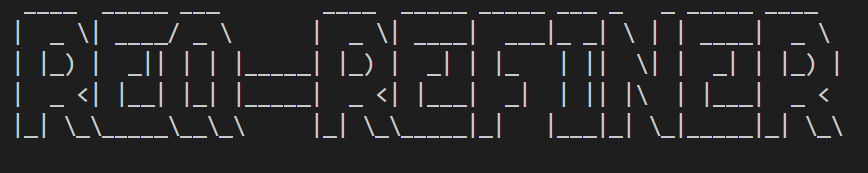
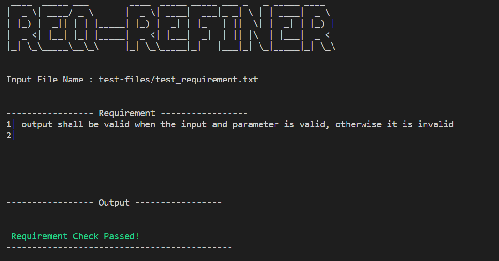
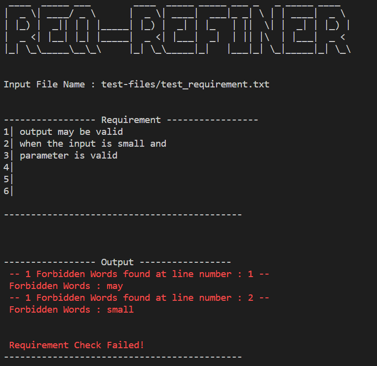

# Req-Refiner



### Pre-requisite
1. Python version 3.10.9 
- https://www.python.org/ftp/python/3.10.9/python-3.10.9-amd64.exe

### Steps to Run

#### 1. Run the main file
```
python main.py
```

### Output

#### 1. Good Requirement


#### 2. Bad Requirement



